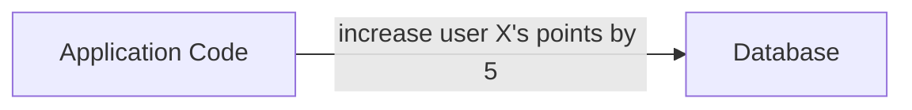
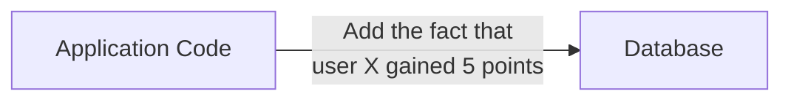

# Eventualize

Eventualize is an opinionated event-sourcing framework that unlocks the untapped potential of transactional data while eliminating many challenges related to management of transactional data and its schema.
Eventualize is quick & easy to integrate, and while it is working with new paradigms and patterns under the hood, it abstracts most of it away and does not distrupt development.

## Understanding Event Sourcing
Event sourcing is an architectural pattern that captures and persists every change as a sequence of events. It provides a historical log of events that can be used to reconstruct the current state of an application at any given point in time. This approach offers various benefits, such as auditability, scalability, and the ability to build complex workflows.

Event sourcing, when combined with the Command Query Responsibility Segregation (CQRS) pattern, offers even more advantages. CQRS separates the read and write concerns of an application, enabling the generation of dedicated databases optimized for specific read or write needs. This separation of concerns allows for more agile and flexible database schema designs, as they are less critical to set up in advance.

## Install

## Quick Start

## Why is it needed?
In most production applications, transactional data is captured and used to update the state of the system.
Here is such an example for a application that updates the amount of points a user has:

It's great for keeping track of the overall points each user has.
However what if down the line you'd like to calculate the average daily points each user earns?
Oh... shoot. Too bad we didn't store this kind of information in the first place.

But this is just it!
You can't anticipate all the things you'd like to do with your data.
And working in this way, you are bound to encounter this scenario at some point.

`Eventualize` solves this by storing the actual facts that the system captured over time. We call those **Events**. So, following the previous example, it might looking like this:

This is great, beacuse now you can calculate many different things based on these events, without changing the way you store the data.
For instance, if you'd like to get the sum total of points a user you just need to fetch all its relevant events and increase total points by the amount specified in the each.
Or if you'd like to get the daily average points, you'll start the same, by fetching all events and performing a different type of calculation for each event.

It's that easy.

In practice, there are some performance optimization and other mechanism that needs to be implemented under the hood. And that is exactly what `Eventualize` does.

