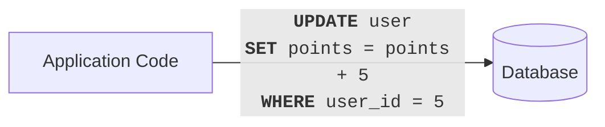
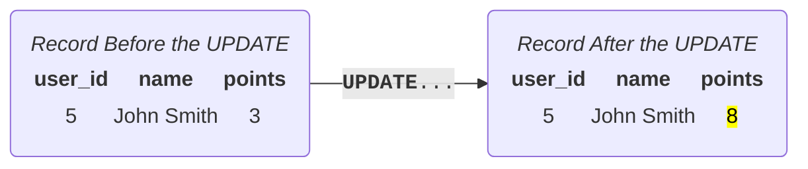
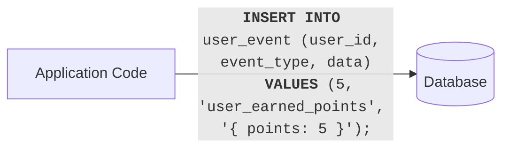
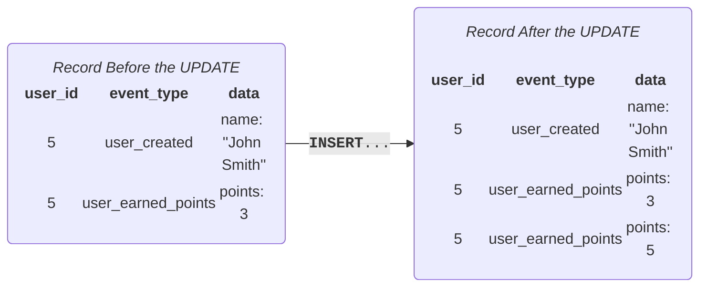
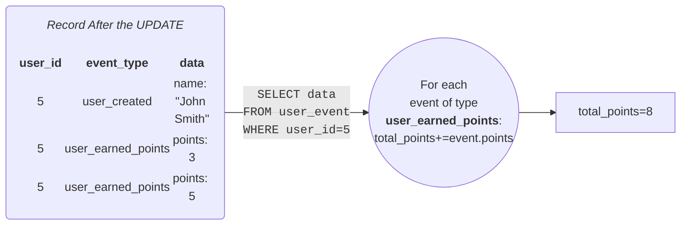
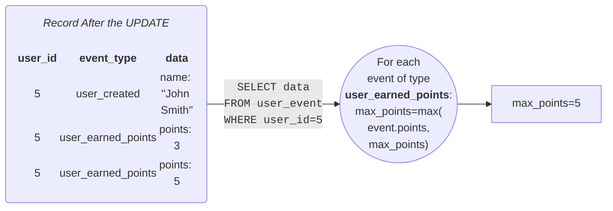

# Eventualize

Eventualize is an opinionated event-sourcing framework that unlocks the untapped potential of transactional data while eliminating many challenges related to management of transactional data and its schema.
Eventualize is quick & easy to integrate, and while it is working with new paradigms and patterns under the hood, it abstracts most of it away and does not distrupt development.

## Install

## Quick Start

## Why is it needed?

In most production applications, transactional data is captured and used to update the state of the system.

Here is such an example for a application that updates the amount of points a user has:

The application update the state of the relevant `user` record by additional more points:

It's great for keeping track of the overall points each user has.
However what if down the line we'd like to see the maximum number of points that a user have earned at any single time?
Oh... shoot. Too bad we didn't store this kind of information in the first place.

But that is just it!
You can't anticipate all the things you'd like to do with your data.
And along the way you are bound to encounter new data driven questions you haven't thought of when you were just starting out.

`Eventualize` solves this by storing the actual facts that the system captured over time. We call those **Events**. So, following the previous example, working with `Eventualize` in pricnciple looks something like this:

We have captured the fact itself (user 5 earned 5 points):

This is great, beacuse now we can calculate many different things based on these events, without changing the way you store the data.
All we need to do is scan of the relevant events that were captured and are related to the user, and aggregate them into the state we are interested in. We call this kind of aggregation a **folding logic**, and you can have multiple floding logics for the same events in order to derive diiferent states for the system.

So, continuing our example, getting the information we want would something like this:

Getting the total amount of points for a user:

Geting the maximum amount of points a user earned in a single time:

It's that easy.

Each round node that use saw above is a folding logic.

You might be thinking: 'OK, pretty cool. But what happens when there are many events that need to be scanned? Wouldn't that take too long and hurt performance?'.
Good question!
This is why `Eventualize` implements a more efficient mechanism that eliminates the performance issues of the naive approach.
This mechanism would be explained in the next section.

## Snapshots - Making Folding Logic Run Fast and Efficiently
