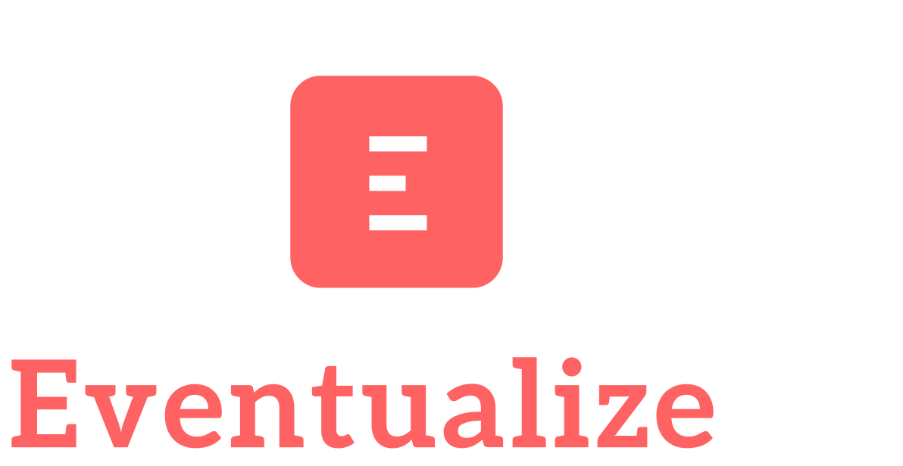

Eventualize is an opinionated event-sourcing framework that unlocks the untapped potential of transactional data while eliminating many challenges related to management of transactional data and its schema.
Eventualize is quick & easy to integrate, and while it is working with new paradigms and patterns under the hood, it abstracts most of it away and does not distrupt development.

<iframe width="560" height="315" src="https://www.youtube.com/embed/vpfuuLTBSzQ?si=6cEqGyFroidIi08I" title="YouTube video player" frameborder="0" allow="accelerometer; autoplay; clipboard-write; encrypted-media; gyroscope; picture-in-picture; web-share" allowfullscreen></iframe>

## Quick Start
If you want to jump right into it, go to [Quick Start](quick-start)

## Learn More
If you want to learn more, go to [Learn More](learn-more).

## Contribute
You can contribute to this project in many ways (not just coding)!
If you are interested to learn more about how you can do this, please visit the [Contribution](contribution) page.