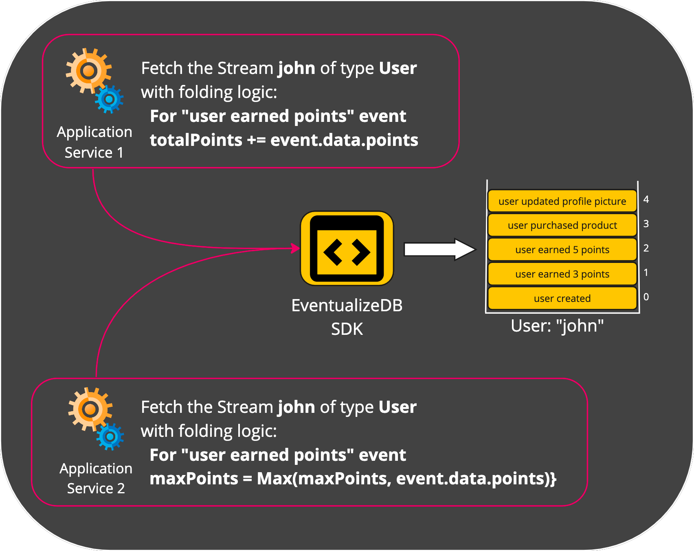

# Aggregates

An **Aggregate** represents a local copy of an Entity's state. 
It is derived from a the entity's Stream. 
Usually, the application code will fetch an aggregate to:

1. Fetch the current state on an Entity.
2. Store new events to the Entity's Stream.

## Creating an Aggregate

You create an aggregate in order to fetch the current state of an Entity.
When you ask `EventualizeDB` to create an aggregate, what it does is:

1. Fetch all the events that are stored in the Entity's Stream
2. "Fold" the fetched events one on top of the other to derive the current state.

To **Fold** means taking a sequence of events and based on their content perform an aggregative calculation. The result of this calculation is the State.

So when a service wants to create an aggregate, it needs to provide to `EventualizeDB`:

1.  The identification of the Entity's Stream in terms of **Stream Type** and **Stream ID**
2.  **Folding Logic**, which is the mapping between an **Event Type** and the **Folding Function** that holds the desired calculation the state based on the event's content.

That means that you can read the same Stream using different Folding Logics, and derive different States from the same Stream!

 

Another important advantage of this approach is the it provides [strong consistency](https://en.wikipedia.org/wiki/Strong_consistency) when creating an Aggregate. This is because immediately after storing an Event, you'll be able to read it, as the Stream includes that Event!

## Capturing Events in an Aggregate
Throughout the application's execution, it'll capture or create one or more events. 
Captured events are not stored directly into the Stream, because it can hurt performance.
Those events will be appended to the ordered collection of **Pending Events** in the Aggregate. 
**Pending Events** are events that were captured locally and not yet stored in the Stream. 
The Folding Logic will also execute the relevant Folding Function, based on the Event's type. This will update the Aggregate's State. 
Capturing Events is a fast operation that can support a high frequency of appends.
Here is an illustration for that:

As you can see, the Event was added to the Pending Events collection, and the State was updated by folding the Event on top of the previous State.

## Storing a local Aggregate
The application code captured some Events and appeneded them to the Aggregate's Pending Events. 
The state of Aggregate also have been updated.
Now we'd like to store those Pending Events into to the respective Stream.
It is really simple actually:
1. The Pending Events are added to the Stream and removed from the Aggregate (as they are no longer pending).
2. If a Snapshot should be created, the current State of the Aggregate is stored as a Snapshot and assigned with the Offset of the latest stored Event.
Here is an illustration of that:

## Production Workload

In order to use Aggregates in a high performing production system, there are 2 additional considerations:

1. **Read Time** - What if there are many events in an Stream? Wouldn't reading all of them in order to derive the state take a long time? For that we have [Snaphots](main-mechanisms/snapshots).
2. **Strong Consistency with Writes** - How can an service or application store an event, only if the Stream hasn't been updated since tha last time it was read? For that we have [Optimistic Concurrency Control](main-mechanisms/occ).

## The structure of an Aggregate

| property                      | data type                               | meaning                                                                                         |
| ----------------------------- | --------------------------------------- | ----------------------------------------------------------------------------------------------- |
| Stream Type                   | string                                  | **Required** The type of the Stream                                                             |
| Stream Id                     | string                                  | **Required** The identification of the Stream                                                   |
| State                         | object                                  | **Required** The current state the aggregate holds                                              |
| Folding Logic                 | dictionary<event type,folding function> | **Required** The folding logic that computed the state                                          |
| Pending Events                | collection<event>                       | **Required** Events that the aggregate holds and have not yet been stored in the Stream.        |
| Offset                        | long                                    | **Required** The last known Stream Offset by the Aggregate. Used for [OCC](main-mechanisms/occ) |
| Min. Events Between Snapshots | int                                     | **Required** Used for [Snapshots](main-mechanisms/snapshots)                                    |
