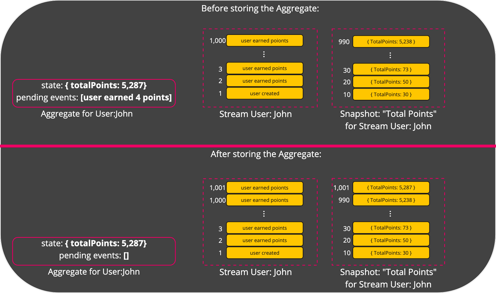

# Local Aggregate
Up until now, we've discussed the aggregate as the place where events of the same entity are stored in. 
This is the stored aggregate. 
However for code to effectively execute, it needs to have a local representation of the aggregate, a **local aggregate**, which can differ, throughout the code's execution, from the stored aggregate.

Let's see how it looks like and how it is used.

## The structure of a local aggregate
A local aggregate has the following:
* **Aggregate Type** - The type of the aggregate
* **Aggregate Id** - The identification of the aggregate
* **State** - The current state the aggregate holds
* **Folding Logic** - The folding logic that computed the state
* **Pending Events** - Events that the local aggregate holds that have not yet been stored in the stored aggregate.

## Creation of local aggregate from a stored aggregate
In order to create a local aggregate, the application code provides to the `Eventualize` SDK:
1. The aggregate type
2. The aggregate ID
3. Folding Logic

Then `Eventualize` locates the relevant stored aggregate, and the latest snapshot of the provided folding logic (if it exists). `Eventualize` folds the events since the latest snapshot (if it exists) and retruns a local aggregate with the following values:
* **Aggregate Type** - As provided by the application
* **Aggregate Id** - As provided by the application
* **State** - The dervied state from folding the events in the stored aggregate
* **Folding Logic** - As provided by the application
* **Pending Events** - An empty collection

Here is an illustration of the process:

The simpler case is when there is no existing stored aggregate.
I that case, the local storage is instantly create with an empty state.

## Capturing events in a local aggregate
Throughout the application's execution, it'll capture or create one or more events. 
Those events will be appended in the local aggregate to the collection of pending events.
This is a very fast operation that can support a high frequency of appends.
Here is an illustration for that:

As you can see, the event was added to the pending events collection, and the state was updated by folding the event on top of the previous state.

## Storing a local aggregate
The application code captured some events and stored them as pending events in the local aggregate.
The state of the local aggregate also have been updated.
Now we'd like to store our local aggregate.
It is really simply actually:
1. The pending events are added to the stored aggregate and removed from the local aggregate (as they are no longer pending storage).
2. If a snapshot should be created, the current state of the local aggregate is stored as a snapshot for the relevant folding logic and event.
Here is an illustration of that:
