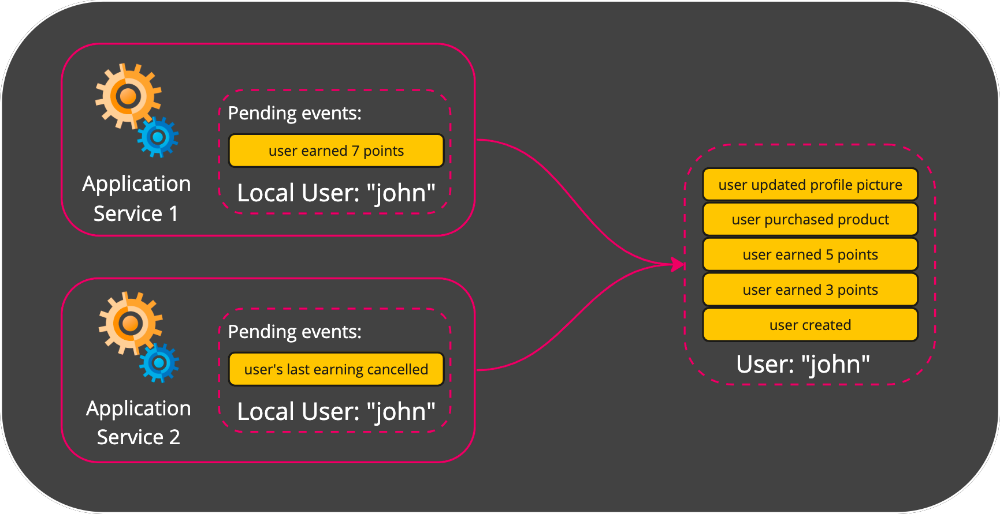
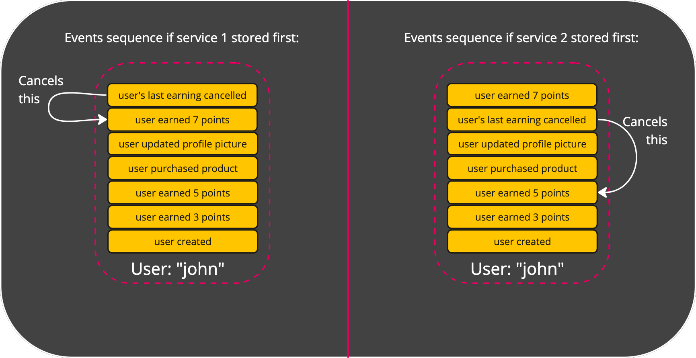
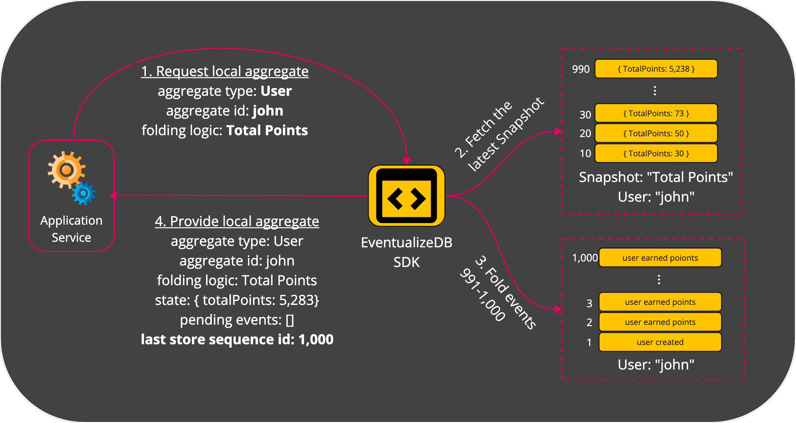
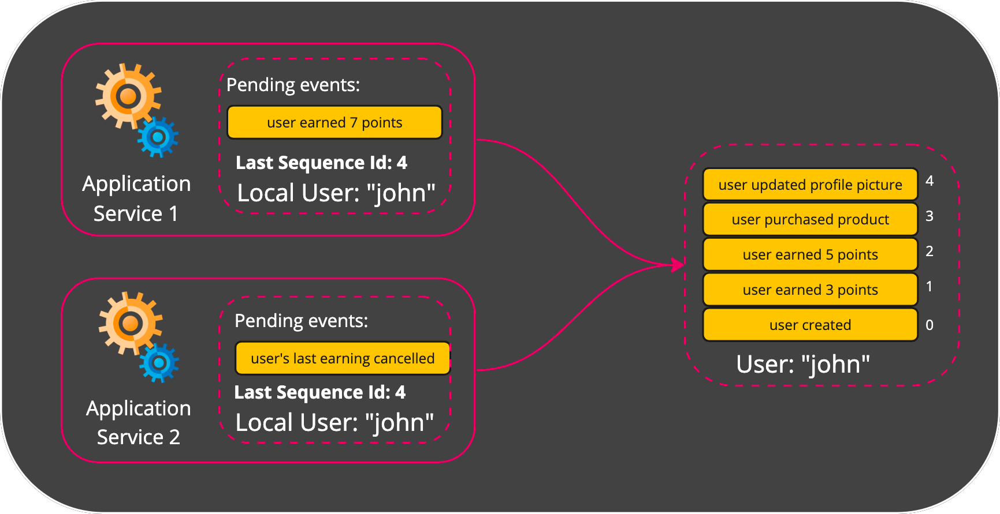

# Optimistic Concurrency Control (OCC)

Optimistic Concurrency Control is a mechanism `Eventualize` uses in order to handle a situation where multiple local aggregates would like to store events into the same stored aggregate.

First, let's understand why is that an issue that needs special handling.

## The Issue of Multiple Writers
Lets assume we have 2 service: service 1 and service 2. 
Both services created a local aggregate from the same stored aggregate "User: john". 
Service 1 added the event "user earned points". 
Service 2 added the event "user's last earning cancelled". 

As you can see, the order of stored events is important. 
If service 2 stores its event first, it'll cancel the points earned before service 1's event. 
If service 1 stores its event fisrt, than the event from service 2 will cancel these earned points.

How can we know which service should store its events first?
How can we let the second serivce know that it's going to store events based on a stale knowledge of the current state?

## Last Stored Sequence Id
When a local aggregate is created, it stores the sequence id of the latest event that was read into the **Last Stored Sequence Id** property.

**Last Stored Sequence Id** comes in handy when we want to store the local aggregate and make sure its state is up-to-date. Before actually performing the store operation, `Eventualize` checks that **Last Stored Sequence Id** is equal to the sequence id of the latest stored event. If it's not, that mean that the local aggregate's request to store pending events is based on a stale knowledge of the current state.

Let's return to our 2 application services example, and add a **Last Stored Sequence Id** to each local aggregate:

Both local aggregate has a **Last Stored Sequence Id** with a value of 4.
When both of the services try to store their pending events at the same time, one of them bound to be the first to succeed (race conditions). After a successful first store operation, the newly added event will receive the sequence id of 5. 
That means that the seond service to try and store its pending events will fail, because its **Last Stored Sequence Id** will still be 4.

The mechanism described here is called [**Optimistic Concurrency Control**](https://en.wikipedia.org/wiki/Optimistic_concurrency_control).

The service that fails to store, will receive an **OCC Exception**. In that case it can refetch the up-to-date state and retry storing the event.

## Many Multiple Writers
What happens if instead of 2 services writes to the same Aggregate, we have 1,000?
An example for that can be a service that receives IoT telemetries at large scale, and might have many instances of itself in order to injust the incoming traffic.

If we perform an OCC check for each write, it'll let a single instance succeed, but will fail the rest of 999 writers. In the next retry 998 writers would fail. And this is neglecting additional writes that might come in during this time. It'll take forever to complete all the store operations!

Usually, when we have a lot of different writers to the same aggregate, the events can be safely stored regardless of what the previous events are (unlike our 2 services example where the order of storage mattered a lot).

For cases like this, you can let `Eventualize` know that a certain store operation can disregard OCC.
When that happens, the events are stored with a sequence id that is incremented automatically for them based on the last sequence id that is already stored in the aggregate.
