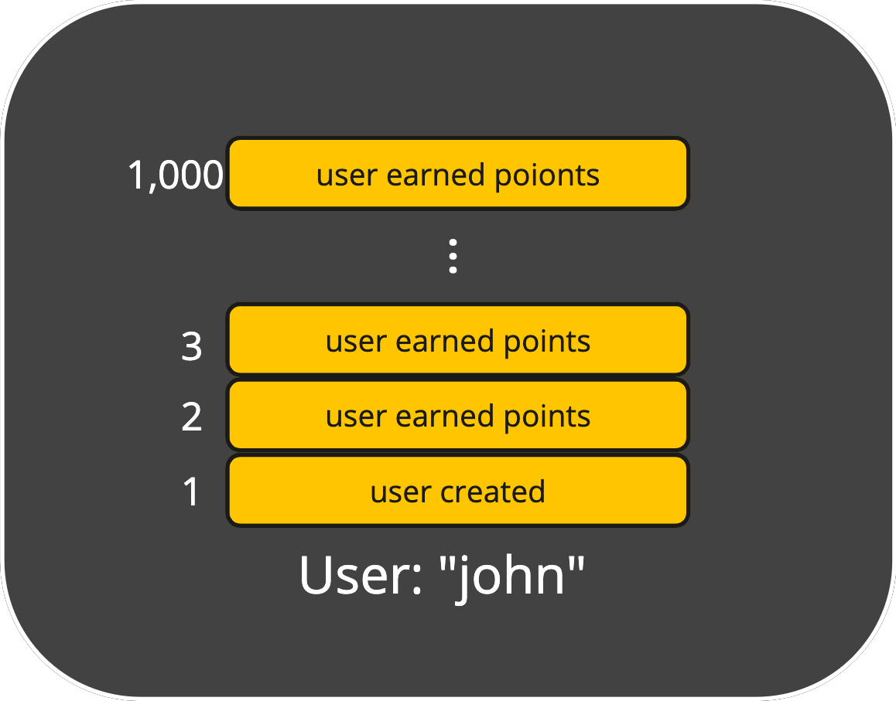
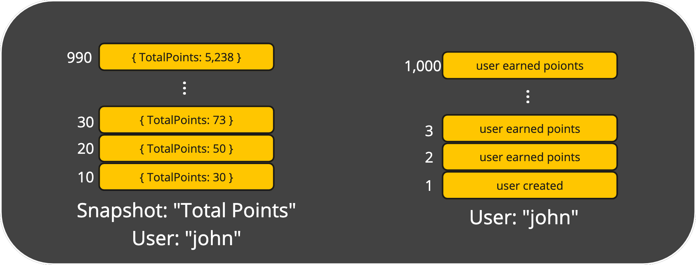
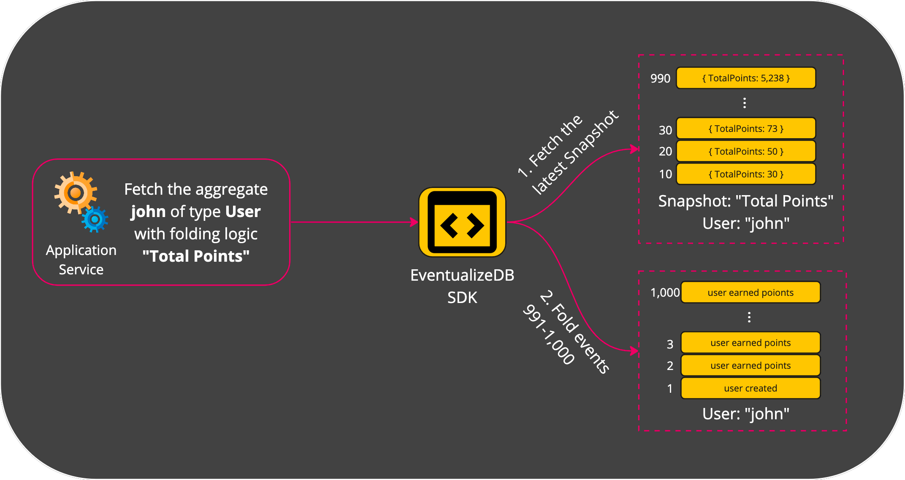

# Snapshots

The purpose of a **Snapshot** is accelarating getting an Aggregate's state.
It does so by optimizing the excution of the **FoldingLogic**.
In essense, a Snapshot is a calculated state that is based on a specific Folding Logic.
Whenever events are starting to pile up within an Aggregate, a Snpashot is created.
So the next time this aggregate is fetched, the state already exist with no required calculations.
If more events are stored since the moment the Snapshot was created, only they are folded unto the the Snapshot's state.

For example, The aggregate of the user "john" holds 1,000 events:

Scanning and folding all these events might take too much time, which can be unreasonable for some use cases.
Let's see what happens when we introduce a Snapshot for the calculating "total points":

As you can see, a Snapshot is like another type of aggregate. 
The difference is, that it stores the state across different points in time for a specific folding logic of a particular aggregate. 
In our example, the snapshot stores the different states of folding logic "Total Points" for the user "john" aggregate. 

The latest state the Snapshot holds is up to event 990. 
That means it is missing the last 10 events.

Let's see how `Eventualize` would fetch the "Total Points" for the user "john" now:

## When does a Snapshot get created?
Every aggregate has a specification of `maximum events between snapshots`.
When event are stored and the latest snapshot is more than this specification's number of events - the state of the aggregate is stored as a new snapshot, that is relevant up to the latest event that is now being stored.
