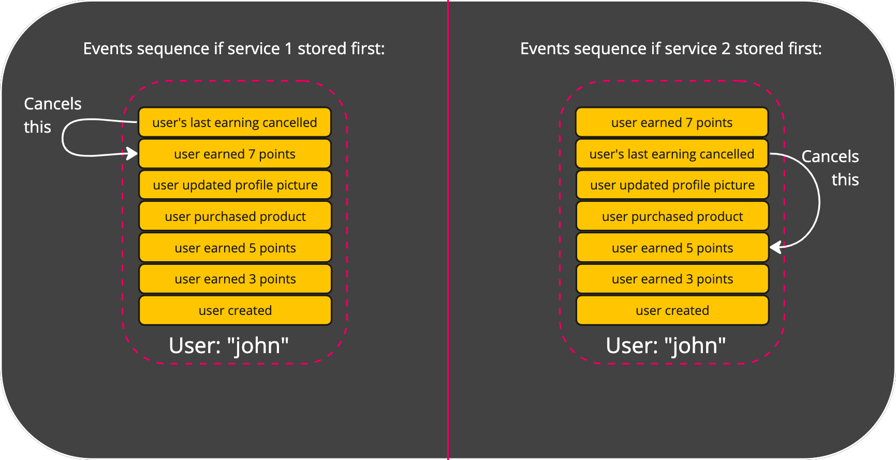
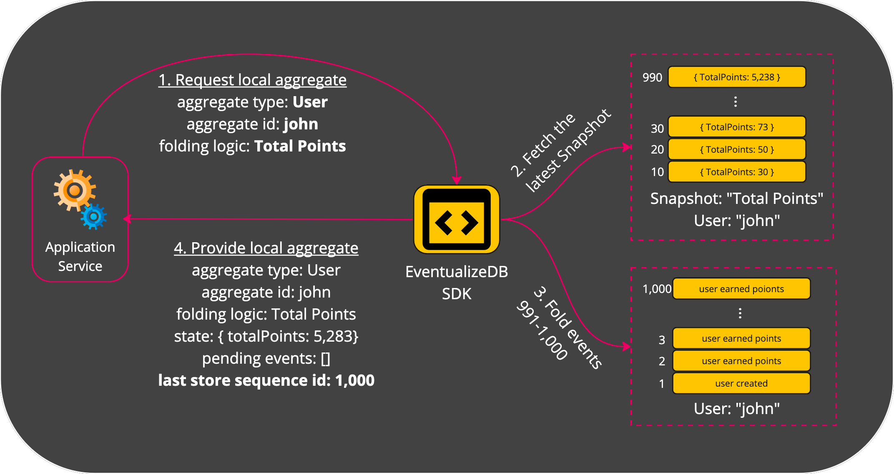

# Optimistic Concurrency Control (OCC)

Optimistic Concurrency Control is a mechanism `Eventualize` uses in order to handle the a situation where multiple local aggregates would like to store events into the same stored aggregate.

First, let's understand why is that an issue that needs special handling.

## The Issue of Multiple Writers
Lets assume we have 2 service: service 1 and service 2. 
Both services created a local aggregate from the same stored aggregate "User: john". 
Service 1 added the event "user earned points". 
Service 2 added the event "user's last earning cancelled". 

As you can see, the order of stored events is important. 
If service 2 stores its event first, it'll cancel the points earned before service 1's event. 
If service 1 stores its event fisrt, than the event from service 2 will cancel these earned points.

How can we know which service should store its events first?
How can we let the second serivce know that it's going to store events based on a stale knowledge of the current state?

## Last Stored Sequence Id
When a local aggregate is created, it stores the sequence id of the latest event that was read into the **Last Stored Sequence Id** property.

