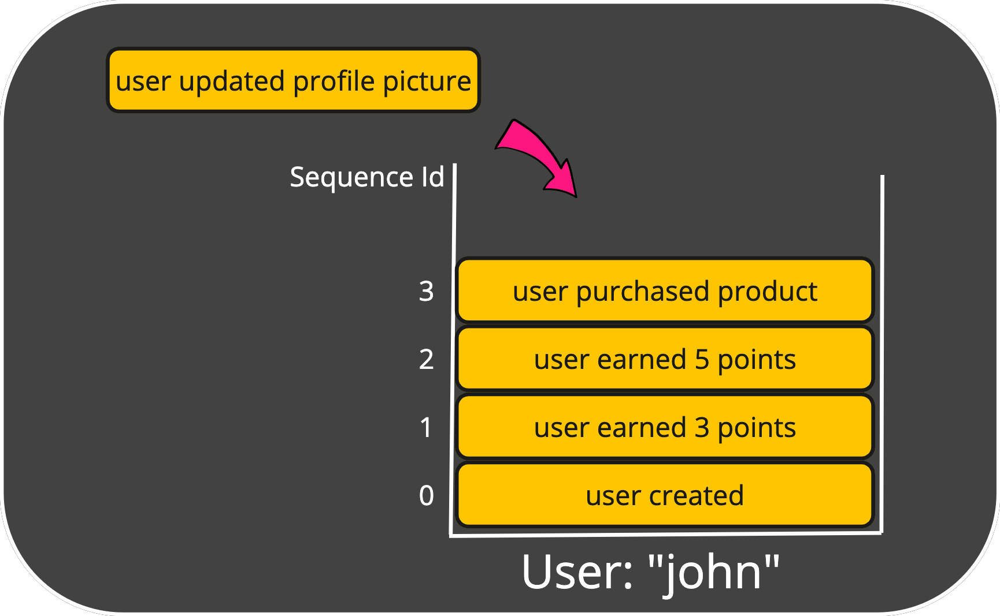

# Streams
Events that are captured, stored in **Streams**.
A Stream holds in once place events that belong to the same entity.
A Stream uses an underlying transactional database of your choice (e.g. SQL Server) to store its events.
In order to easily locate a Stream, it has a **Stream Type** and a **Stream Id**.
The combination of both needs to be unique across the system.

For example, you can define a Stream of type `user` with an id of `John`.
Now you can store all events that belong to the user "John" in that Stream. 
Each stored event gets an **Offset**, which is just an incrementing (long) integer that represents the position of the event within the Stream.

If you have a lot of entities (e.g. users), you'll have a lot of Streams.
That's ok, as Steams are lightweight and performant.

Other than storing events, you would probably also like to aggregate them into different states.
This is what [Aggregates](aggregates) are for.