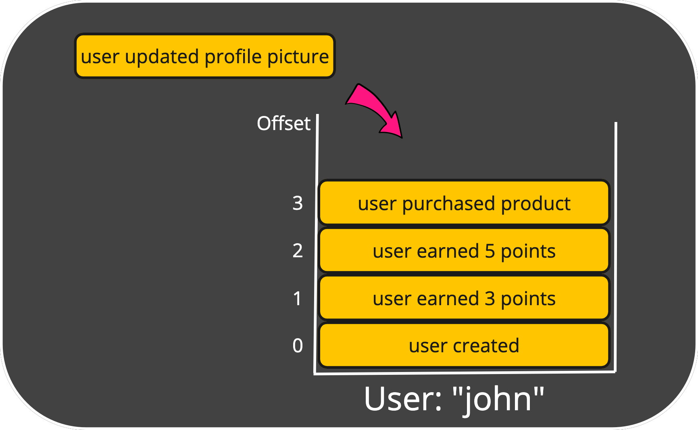

## Streams
Events that are captured, stored in **Streams**.
A Stream holds in once place events that belong to the same entity.
A Stream uses an underlying transactional database of your choice (e.g. SQL Server) to store its events.
In order to easily locate an Stream, it has a **Stream Type** and an **Stream Id**.
The combination of both need to be unique across the system.

For example, you can define an Stream of type `user` with an id of `john`.
Now you can store all events that belong to the user "John" in that Stream. 
Each stored event gets an **Offset** which is just a incrementing (long) integer that represents the position of the event within the Stream.

