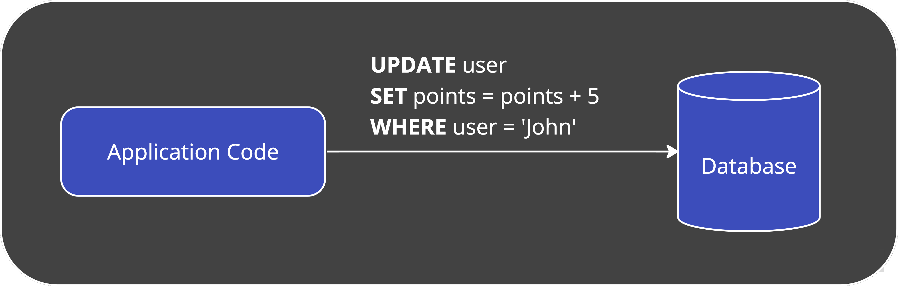
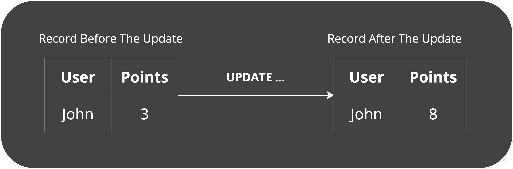
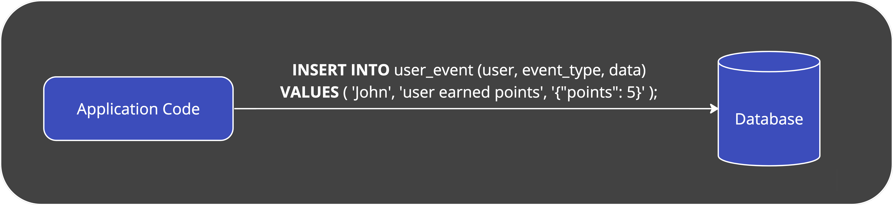
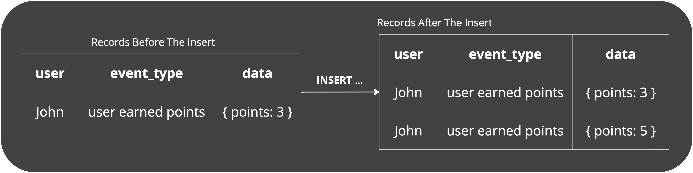
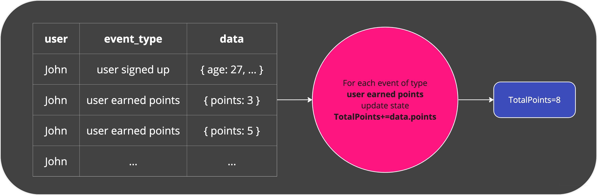
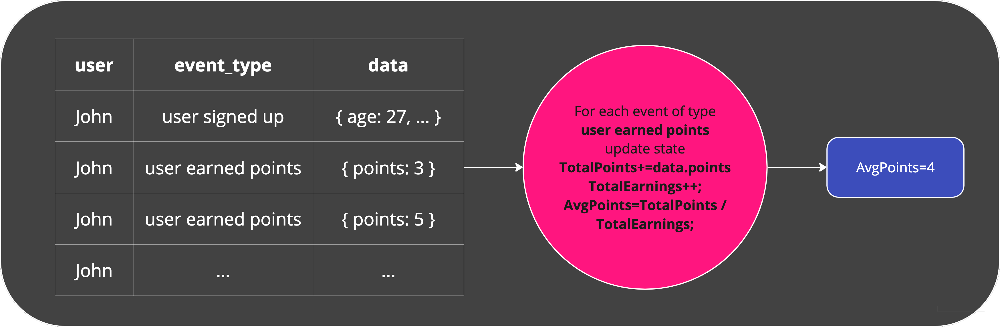

# Why Should I Use It?

In most production applications, transactional data is captured and used to update the state of the system.

Here is such an example for a application that updates the amount of points a user has:

The application updates the state of the relevant `user` record by increasing the points of the user with the additional points:

It's great for keeping track of the overall points each user has.
However, each time we update users points, we overwrite the previous amount of points they had.
What if down the line we'd like to see the average number of daily points that earned by the user?
Oh... shoot. Too bad we didn't store the previous amounts in the first place.

But that is just it!
You can't anticipate all the things you'd like to do with your data.
And along the way you are bound to encounter new data driven questions you haven't thought of when you were just starting out.

`Eventualize` solves this by storing the actual facts that the system captured over time. We call those **Events**. So, following the previous example, working with `Eventualize` in principle looks something like this:

We have captured the fact itself (user 5 earned 5 points):

This is great, because now we can calculate many different things based on these events, without changing the way you store the data.
All we need to do is scan of the relevant events that were captured and are related to the user, and aggregate them into the state we are interested in. We call this kind of aggregation a **folding logic**, and you can have multiple folding logics for the same events in order to derive different states for the system.

So, continuing our example, getting the information we want would something like this:

Total amount of points:

Average points per earning:

It's that easy.

Each pink circle that you saw above is a folding logic, and each box after that node is the resulting state.

At this point, you probably have some questions.
Like: 
'What happens when there are many events that need to be scanned? Wouldn't that take too long and hurt performance?'
'What if the events are stored in the wrong order?'
and many more.

There are several mechanisms that need to be put in place in order for event sourcing to work not only in principal but also in real life. This is why we have built `Eventualize` - so you wouldn't have to!
The next sections should give you a pretty good understanding on how it all works.

So let's go to the next section!